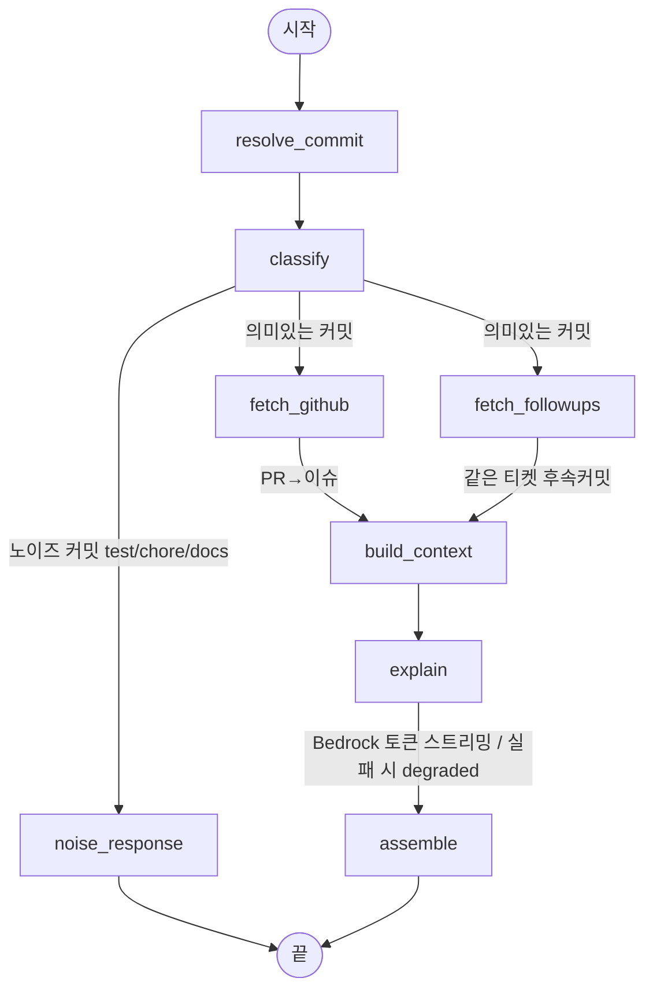
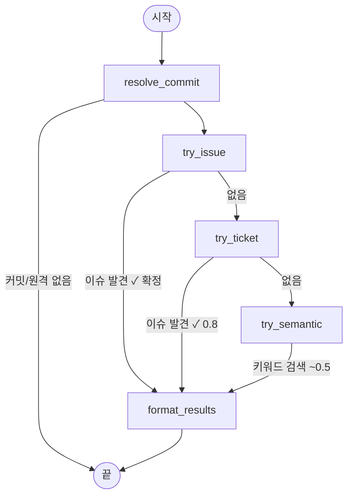

# CodeWhy

> 코드의 이름표 대신 **사유서**를, 커밋 로그 대신 **요점 정리**를, 코드에서 기획서로 가는 **지름길**을.

CodeWhy는 코드의 **맥락과 의도**를 알려주는 AI 기반 VSCode 확장입니다.
`git blame`이 *누가·언제* 바꿨는지만 알려줄 때, CodeWhy는 *왜* 바꿨는지까지 설명합니다.

---

## ✨ 핵심 기능

### 1. 컨텍스트 블레임 — "이 코드, 왜 바꿨어?"

선택한 라인이 **왜** 바뀌었는지를 기획 의도와 함께 설명합니다.

```
기존 git blame:  홍길동이 3개월 전에 수정함
        CodeWhy:  홍길동 님이 3월 15일, '해외 결제 시 수수료 3% 적용'이라는
                  기획 내용을 반영하기 위해 이 코드를 추가했습니다.
```

- 관련 기획서 출처, 담당 팀, 같은 PR·티켓에서 함께 일어난 변경까지 사이드바에 정리
- **AI에게 더 묻기**로 해당 라인 맥락 위에서 후속 질문 가능

> 에디터에서 라인을 선택한 뒤 **우클릭 → CodeWhy: 이 코드, 왜 바꿨어?**

### 2. 타임라인 요약 — "이 파일의 역사"

수백 개의 커밋을 직접 읽지 않아도, AI가 파일의 변경 흐름을 한 문단과 주요 마일스톤으로 정리합니다.

```
이 파일은 1월에 처음 만들어졌고, 2월에 로그인 기능이 추가됐으며,
3월에는 보안 강화를 위해 검증 로직이 한 번 엎어졌습니다.
```

> 에디터 **우클릭 → CodeWhy: 이 파일의 역사 요약**

### 3. 요구사항 역추적 — "원본 기획서 찾기"

코드 한 줄에서 출발해, 그 변경과 연결된 **원본 기획 문서**를 찾아 바로 열어 줍니다.

- 커밋의 티켓·내용을 기반으로 연관 문서를 다단계로 탐색
- 연관 발췌문·페이지와 함께, 신뢰도(확정 / 추정)를 구분해 표시
- 결과에서 원본 문서를 바로 다운로드

> 에디터 **우클릭 → CodeWhy: 원본 기획서 찾기**

---

## 🚀 사용법

1. 활동 바(Activity Bar)의 **CodeWhy** 아이콘으로 사이드바를 엽니다.
2. 코드 에디터에서 궁금한 **라인을 선택**합니다.
3. **우클릭 메뉴**에서 원하는 기능을 고르면, 결과가 사이드바에 나타납니다.

### ⌨️ 단축키

| 단축키 | 동작 |
| --- | --- |
| `Ctrl+Alt+B` (mac: `Cmd+Alt+B`) | 현재 라인의 블레임 정보 고정/해제 |

### 📋 명령어 (Command Palette: `Ctrl+Shift+P`)

| 명령 | 설명 |
| --- | --- |
| `CodeWhy: 이 코드, 왜 바꿨어?` | 컨텍스트 블레임 분석 |
| `CodeWhy: 이 파일의 역사 요약` | 타임라인 요약 |
| `CodeWhy: 원본 기획서 찾기` | 요구사항 역추적 |
| `CodeWhy: 커밋 상세 보기` | 블레임된 커밋 상세 |
| `CodeWhy: 현재 라인 블레임 고정/해제` | 블레임 핀 토글 |

---

## ⚙️ 설정

VSCode 설정(`settings.json` 또는 설정 UI)에서 조정할 수 있습니다.

| 설정 키 | 설명 | 기본값 |
| --- | --- | --- |
| `codewhy.codeLens.enabled` | 에디터 라인에 '🔍 왜 바꿨어?' CodeLens 표시 여부 | `true` |
| `codewhy.hover.enabled` | 분석된 라인 위 마우스 호버 팝업 표시 여부 | `true` |
| `codewhy.backendUrl` | **[고급]** 분석 백엔드 서버 주소. 자체 호스팅 시에만 변경 | `http://localhost:8000` |

---

## 📦 요구사항

- **Visual Studio Code** 1.118.0 이상
- **CodeWhy 백엔드 서버** — AI 분석은 백엔드에서 수행됩니다. `codewhy.backendUrl`이 가리키는 서버가 실행 중이어야 합니다.

백엔드 설치·실행 방법은 아래 개발 문서를 참고하세요.

---

## 🧩 AI 오케스트레이션 (LangGraph)

블레임·역추적의 다단계 파이프라인은 **LangGraph `StateGraph`** 로 선언적으로 구성됩니다 —
조건 분기, 병렬 fan-out/fan-in, 폴백을 한 그래프에서 표현하고, **토큰 스트리밍은 그대로 유지**합니다
(`astream_events`). 그래프 정의: `backend/app/ai/blame_graph.py`, `backend/app/ai/trace_graph.py`.

### 컨텍스트 블레임 — 병렬 조회 + 조건 분기 + 스트리밍



> `fetch_github`(PR+이슈)와 `fetch_followups`는 **병렬**로 실행돼 `build_context`에서 만난다(fan-in 1회).
> 노이즈 커밋은 LLM·GitHub 호출 없이 즉시 응답. `explain` 노드의 LLM 토큰은 SSE `delta`로 실시간 전달.

### 요구사항 역추적 — issue → ticket → semantic 폴백 체인



> 각 폴백 단계가 명명된 노드 + 조건 엣지라 "왜 이 matchType이 나왔는가"가 한눈에 보입니다.

> 그래프 다이어그램은 `python -m app.ai.blame_graph` / `python -m app.ai.trace_graph` 로 직접 출력할 수 있습니다.

---

## 📚 더 보기

| 문서 | 내용 |
| --- | --- |
| [DEVELOPMENT_GUIDE.md](DEVELOPMENT_GUIDE.md) | 아키텍처·백엔드 실행·개발 현황·TODO |
| [PACKAGING_GUIDE.md](PACKAGING_GUIDE.md) | 확장 패키징 및 배포 |

---

## 📄 라이선스

MIT License
 