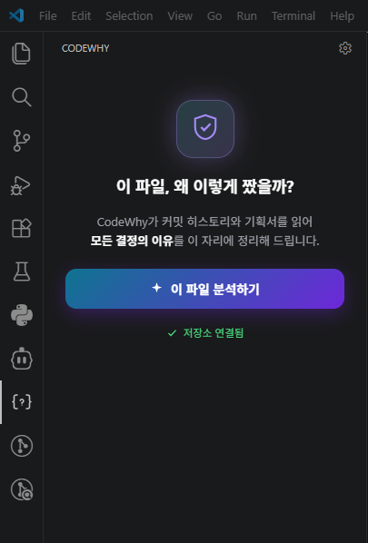
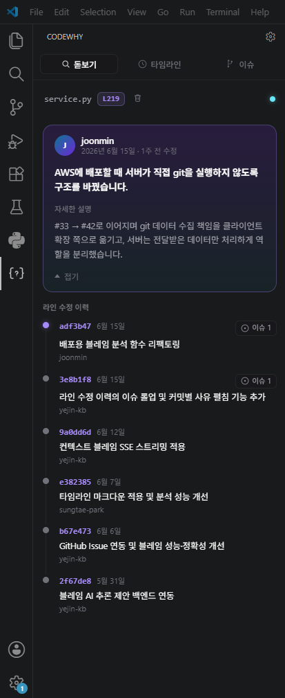
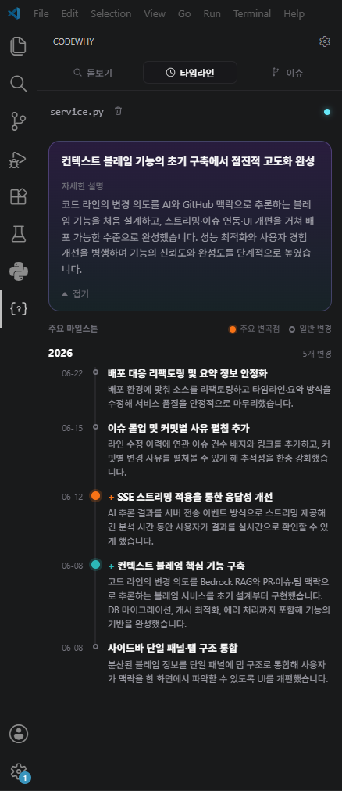
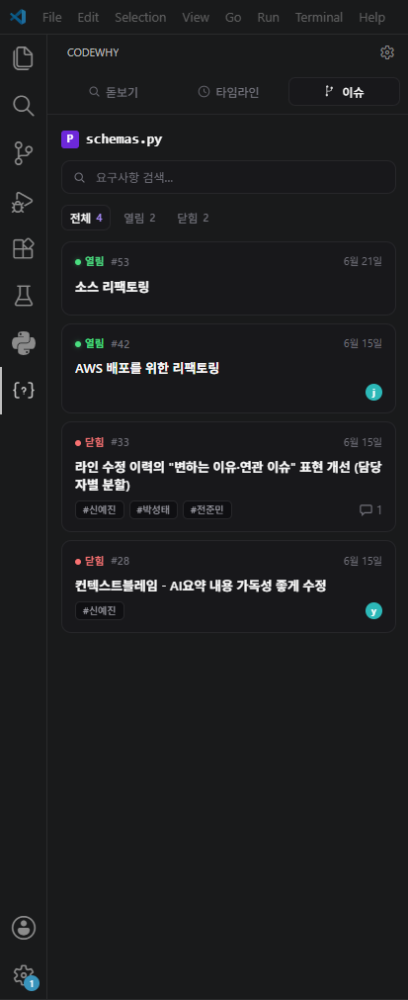
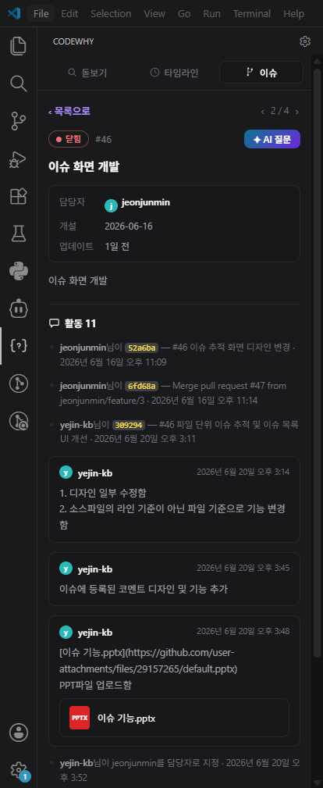
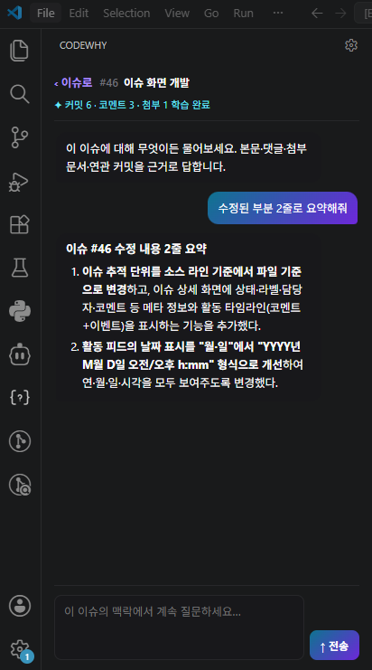

# CodeWhy

> 코드의 이름표 대신 **사유서**를, 커밋 로그 대신 **요점 정리**를, 코드에서 기획서로 가는 **지름길**을.

CodeWhy는 코드의 **맥락과 의도**를 알려주는 AI 기반 VSCode 확장입니다.
`git blame`이 *누가·언제* 바꿨는지만 알려줄 때, CodeWhy는 *왜* 바꿨는지까지 설명합니다.

<!-- 📸 캡처 자리: CodeWhy 사이드바 + 에디터 전체 모습(대표 스크린샷) -->
<p align="center">
  
</p>

---

## ✨ 핵심 기능

### 1. 돋보기 — "이 코드, 왜 바꿨어?"

선택한 라인이 **왜** 바뀌었는지를 기획 의도와 함께 설명합니다.

```
기존 git blame:  홍길동이 3개월 전에 수정함
        CodeWhy:  홍길동 님이 3월 15일, '해외 결제 시 수수료 3% 적용'이라는
                  기획 내용을 반영하기 위해 이 코드를 추가했습니다.
```

- 관련 기획서 출처, 담당 팀, 같은 PR·티켓에서 함께 일어난 변경까지 사이드바에 정리

> 에디터에서 라인을 선택한 뒤 **우클릭 → CodeWhy: 이 코드, 왜 바꿨어?**

<!-- 📸 캡처 자리: 돋보기 분석 결과가 사이드바에 표시된 화면 -->
<p align="center">
  
</p>

### 2. 타임라인 요약 — "이 파일의 역사"

수백 개의 커밋을 직접 읽지 않아도, AI가 파일의 변경 흐름을 한 문단과 주요 마일스톤으로 정리합니다.

```
이 파일은 1월에 처음 만들어졌고, 2월에 로그인 기능이 추가됐으며,
3월에는 보안 강화를 위해 검증 로직이 한 번 엎어졌습니다.
```

> 에디터 **우클릭 → CodeWhy: 이 파일의 역사 요약**

<!-- 📸 캡처 자리: 타임라인 요약(한 문단 + 주요 마일스톤)이 표시된 화면 -->
<p align="center">
  
</p>

### 3. 요구사항 찾기 — "이 코드, 어디서 시작됐어?"

코드 한 줄에서 출발해, 그 변경과 연결된 **요구사항 이슈**를 찾아 줍니다.

- 연관 이슈를 한곳에 모아 보여주고, 키워드 검색·열림/닫힘 상태로 필터
- 이슈 상세에서 담당자·개설/업데이트 시점은 물론, 연관 커밋·댓글·첨부 문서까지 **활동 타임라인**으로 정리
- **AI 질문**으로 이슈 본문·댓글·첨부·연관 커밋을 근거로 요약하거나 후속 질문 가능

> 에디터 **우클릭 → CodeWhy: 요구사항 찾기**

<!-- 📸 캡처 자리: 연관 이슈 목록 → 상세 → AI 요약으로 이어지는 역추적 흐름 -->
<p align="center">
  
  
  
</p>

---

## 🚀 사용법

1. 활동 바(Activity Bar)의 **CodeWhy** 아이콘으로 사이드바를 엽니다.
2. 코드 에디터에서 궁금한 **라인을 선택**합니다.
3. **우클릭 메뉴**에서 원하는 기능을 고르면, 결과가 사이드바에 나타납니다.


### 📋 명령어 (Command Palette: `Ctrl+Shift+P`)

| 명령 | 설명 |
| --- | --- |
| `CodeWhy: 이 코드, 왜 바꿨어?` | 돋보기 분석 |
| `CodeWhy: 이 파일의 역사 요약` | 타임라인 요약 |
| `CodeWhy: 요구사항 찾기` | 연관 요구사항 이슈 찾기 |
| `CodeWhy: 커밋 상세 보기` | 돋보기 결과에서 참조한 커밋 상세 확인 |
| `CodeWhy: 현재 라인 돋보기 고정/해제` (`Ctrl+Alt+B`) | 커서 이동과 무관하게 돋보기 결과를 고정 |
| `CodeWhy: 설정 열기` | CodeWhy 설정 화면 바로가기 |
| `CodeWhy: 이 파일의 타임라인 캐시 비우기` | 타임라인 요약 캐시 초기화 |
| `CodeWhy: 이 파일의 돋보기 캐시 비우기` | 돋보기 분석 캐시 초기화 |

---

## ⚙️ 설정

VSCode 설정(`settings.json` 또는 설정 UI)에서 조정할 수 있습니다.

| 설정 키 | 설명 | 기본값 |
| --- | --- | --- |
| `codewhy.codeLens.enabled` | 에디터 라인 위에 "🔍 왜 바꿨어?" CodeLens 표시 여부 | `true` |
| `codewhy.hover.enabled` | 분석된 라인에 마우스를 올렸을 때 돋보기 요약 팝업 표시 여부 | `true` |
| `codewhy.backendUrl` | **[고급]** 분석 백엔드 서버 주소. 자체 호스팅 시에만 변경 | `http://3.37.125.200:8000` |
| `codewhy.devBackendUrl` | **[개발자]** F5(Extension Development Host)로 실행할 때 사용할 로컬 백엔드 주소. 설치본(.vsix/마켓플레이스)에서는 무시됨 | `http://localhost:8000` |

---

## 📦 요구사항

- **Visual Studio Code** 1.118.0 이상
- **CodeWhy 백엔드 서버** — AI 분석은 백엔드에서 수행됩니다. `codewhy.backendUrl`이 가리키는 서버가 실행 중이어야 합니다.

백엔드는 서버에 배포되어 있어 일반 사용자는 별도 설치가 필요 없습니다.

---

## 📄 라이선스

MIT License
 